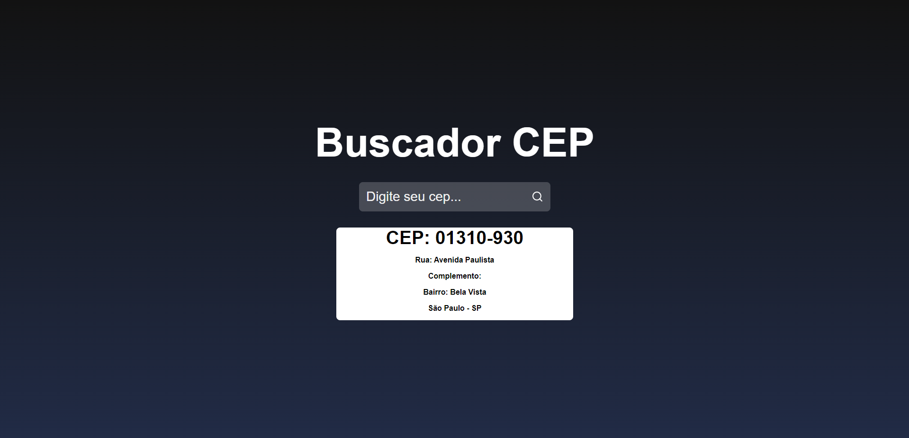

</br>


       
<p>PROJETO EM REACT.JS | JAVASCRIPT</p>
<hr>
</br>
    <p aling="center"> 🗺️ Busca Cep é um projeto que foi realizado seguindo aulas do <a href="https://www.youtube.com/watch?v=oy4cbqE1_qc&ab_channel=Sujeitoprogramador"> Sujeito Programador, </a> Simplesmente o nome já diz tudo, Ele Busca Seu Cep! </p>
</br>
       

    
</br>

### 🎲 Rodando o Front 

```bash

    # Clone este repositório  
    $ git clone <https://github.com/KayoSilva19/Buscador-De-Cep-Ract.Js.git>

    # Acesse a pasta do projeto no terminal/cmd
    $ cd buscador

    $ npm install

    $ npm start

```
